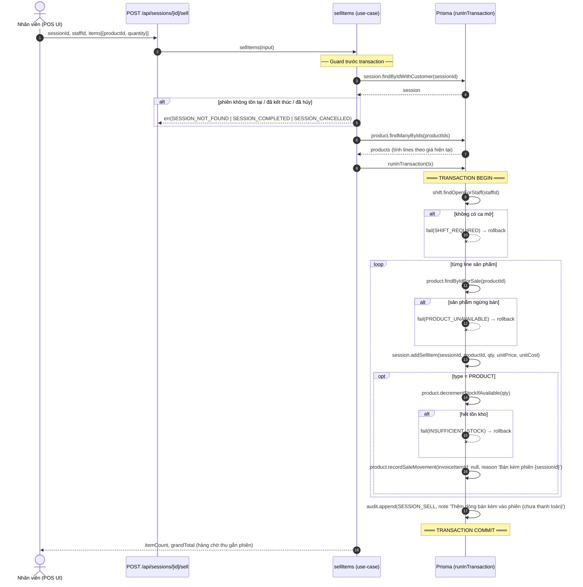
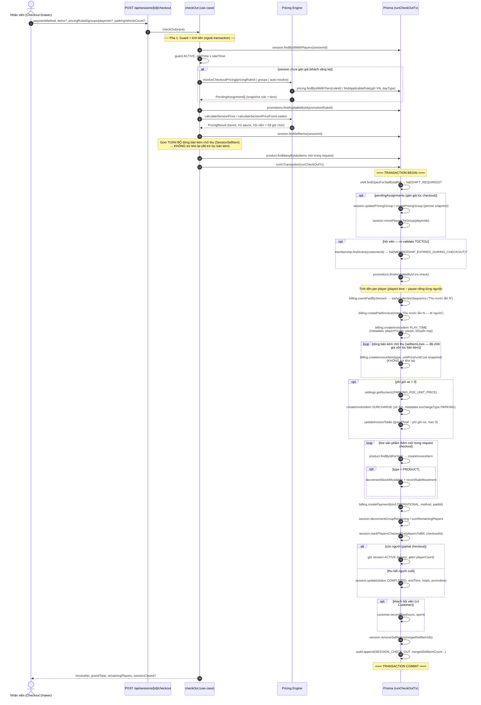
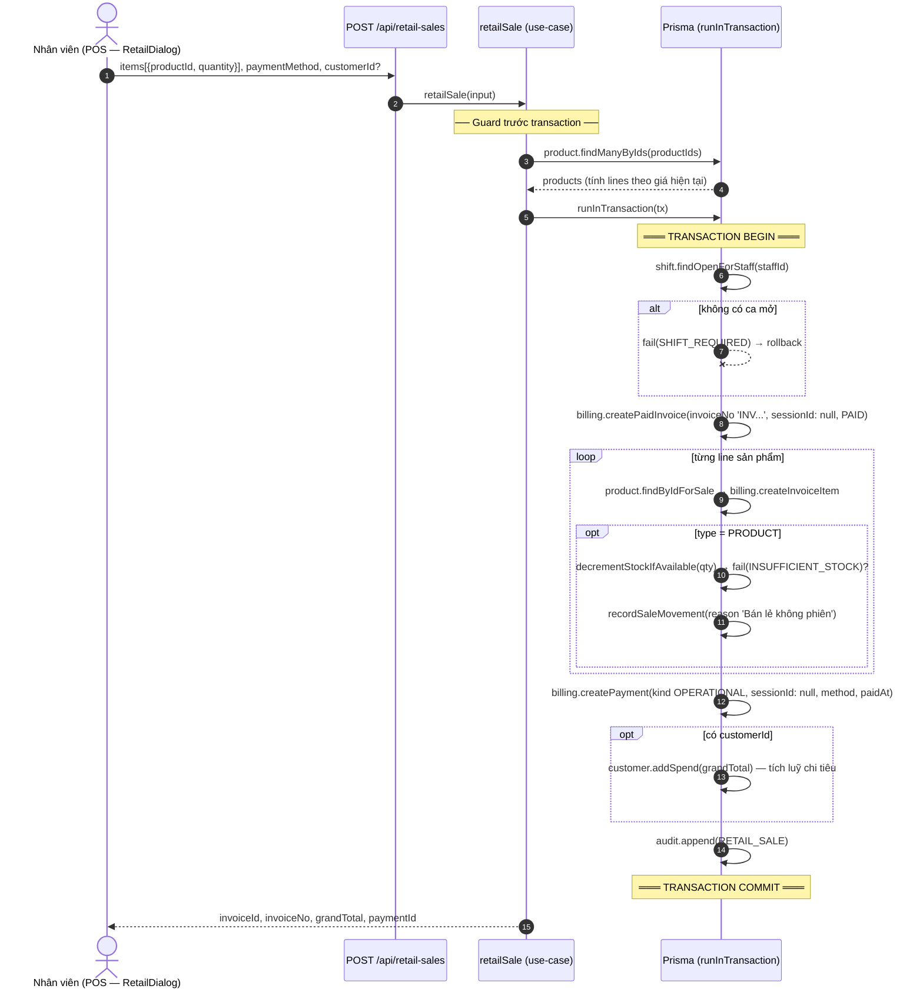

# Sequence Diagram — Luồng Bán kèm + Checkout + Bán lẻ

> Được sinh từ codebase `qltruongcung` (Next.js + Prisma). Actor: Nhân viên POS.
> - Use-case bán kèm: `src/lib/sessions/use-cases/sell-items.ts`
> - Use-case checkout: `src/lib/sessions/use-cases/check-out.ts` (`runCheckOutTx`)
> - Use-case bán lẻ: `src/lib/invoicing/use-cases/retail-sale.ts`
>
> **Ghi chú kiến trúc:** bán kèm KHÔNG tạo hóa đơn SEL/DRAFT nữa — ghi dòng tạm vào bảng `SessionSellItem` (`session_sell_items`); khi checkout tạo **1 invoice `INV-` duy nhất** chứa `PLAY_TIME` + các dòng bán kèm.

---

## Luồng 1 — Bán kèm (thêm hàng vào phiên đang chơi)

Ghi dòng bán kèm tạm `SessionSellItem`, trừ kho ngay nhưng **chưa tạo hóa đơn, chưa thu tiền**.

**Điểm mấu chốt:** bán kèm chỉ ghi **dòng chờ thu** (`SessionSellItem`) + trừ kho ngay, **không tạo hóa đơn** nào. Xoá dòng chưa checkout (DELETE `/api/sessions/[id]/sell-items`) sẽ hoàn kho.

---

## Luồng 2 — Checkout (thu tiền + đóng phiên + gộp bán kèm vào invoice INV duy nhất)

**Điểm mấu chốt của checkout:** mỗi dòng bán kèm chờ thu được **gộp vào invoice INV duy nhất đúng 1 lần** (tạo InvoiceItem từ snapshot giá, sau đó xoá dòng ngay trong cùng transaction) — tránh double-billing khi "thu trước" nhiều lần; kho chỉ trừ thêm cho hàng gửi kèm request checkout, không trừ lại hàng đã trừ lúc bán kèm.

---

## Luồng 3 — Bán lẻ (nước/dịch vụ không gắn phiên, thu tiền ngay)

**Điểm mấu chốt:** bán lẻ tạo **invoice PAID + payment ngay** (không gắn phiên), trừ kho 1 lần khi bán, tích luỹ chi tiêu nếu chọn khách hội viên/vãng lai đã lưu.
