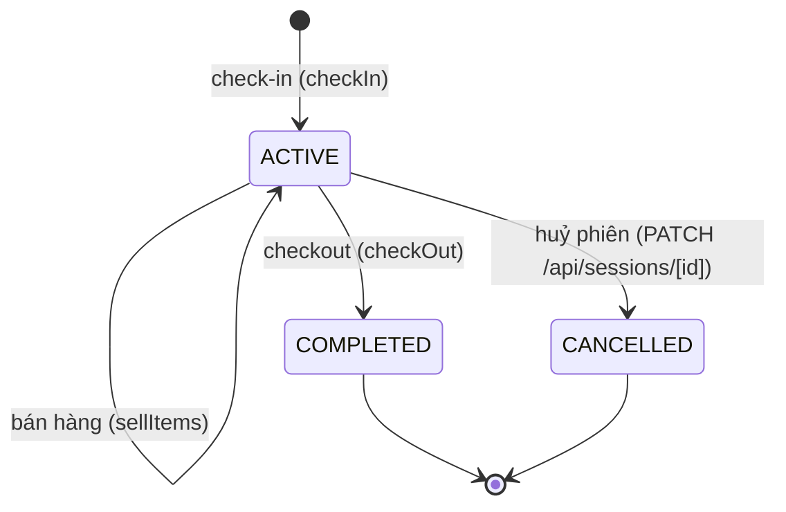
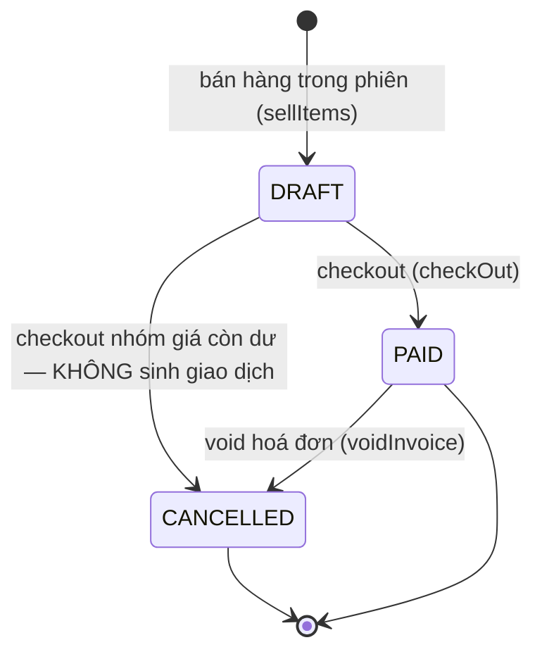
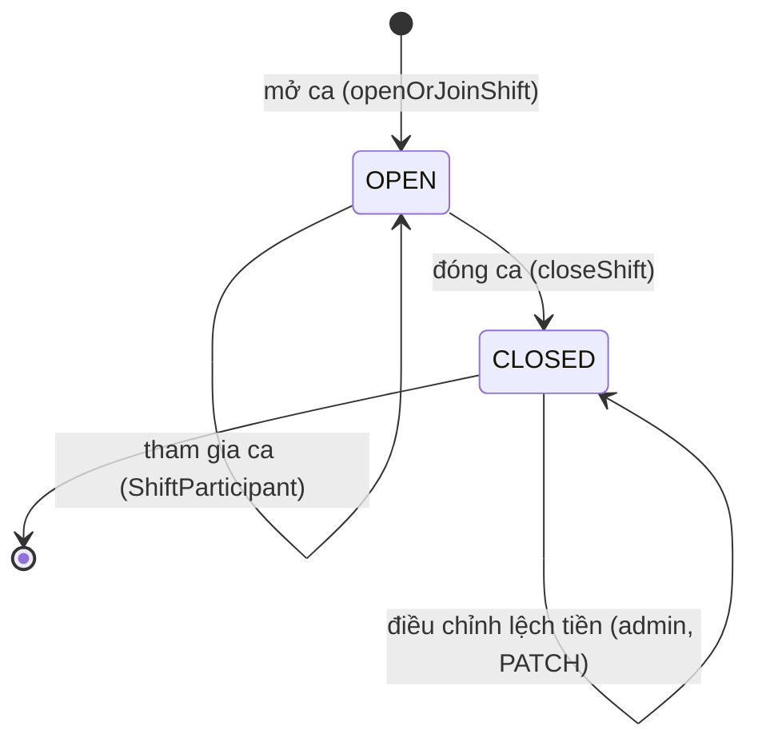

# State machine — Luồng phát sinh giao dịch

> Ngày: 2026-08-06 | Trạng thái: Thiết kế

## Phạm vi

Mô hình hoá vòng đời của **giao dịch** trong hệ thống POS — từ lúc phiên chơi được tạo, phát sinh hoá đơn/thanh toán, đến đối soát ca và điều chỉnh (void). **Giao dịch** được định nghĩa là 2 loại bản ghi tiền:

- `Payment` — thanh toán hoá đơn (invoice)
- `MembershipPayment` — phí hội viên (song song với invoice `MEM`)

Đây cũng chính là 2 nguồn dữ liệu của màn Giao dịch (`/transactions` → `getShiftTransactions`) và báo cáo ca (`/api/reports/shifts/[id]`).

## Nguyên tắc nền

1. **Append-only**: giao dịch không sửa, không xoá. Mọi điều chỉnh tạo bản ghi mới (refund âm).
2. **Invoice-first**: mọi giao dịch đi qua `Invoice → InvoiceItem → Payment`, không có `Session → Payment` trực tiếp.
3. **Ca là nguồn gốc**: mọi giao dịch thu tiền gắn `shiftId`; đóng ca chốt số liệu đối soát.
4. **MEMBER không phải tiền mặt**: thanh toán qua hội viên không thu tiền mặt tại quầy → vào `totalRevenue` nhưng **không** vào `expectedCash` (xem `calculateExpectedCash` trong `src/lib/business/shifts.ts`).

## Tổng quan: 4 máy trạng thái liên kết

```
┌─────────────┐  sinh      ┌─────────────┐  khi PAID   ┌──────────────────┐
│   Session   │ ─────────▶ │   Invoice   │ ──────────▶ │  Payment (giao dịch) │
│ (phiên chơi)│            │  (hoá đơn)  │             └──────────────────┘
└─────────────┘            └─────────────┘
        ▲                       ▲
        │                       │ (invoice MEM)
┌───────┴─────────┐     ┌───────┴───────────────┐
│      Shift      │     │ MembershipPayment      │
│  (ca làm, bao)  │     │ (giao dịch phí hội viên)│
└─────────────────┘     └───────────────────────┘
```

`Shift` là ngữ cảnh bao trùm: mọi giao dịch thu tiền đều gắn `shiftId` của ca đang mở mà nhân viên tham gia; đóng ca chốt lại các giao dịch đã phát sinh.

---

## 1. Session (phiên chơi) — nguồn phát sinh



| Sự kiện | Từ → Đến | Guard | Side effects | Nguồn |
|---|---|---|---|---|
| `check-in` | (mới) → `ACTIVE` | khách chưa có session ACTIVE (`ACTIVE_SESSION_EXISTS`); nhân viên trong ca mở; vãng lai cần `PricingRule` hiệu lực (không fallback giá); hội viên cần membership còn hạn | snapshot rule + tier + khuyến mại vào session; `ActivityLog(SESSION_CHECK_IN)` | `use-cases/checkIn.ts` |
| `bán hàng` | `ACTIVE` → `ACTIVE` | session chưa kết thúc (`SESSION_COMPLETED`/`SESSION_CANCELLED`); đủ tồn kho (`INSUFFICIENT_STOCK`); có ca mở (`SHIFT_REQUIRED`) | tạo Invoice `DRAFT`; trừ kho `StockMovement(SALE)` ngay khi bán; `ActivityLog(SESSION_SELL)` | `use-cases/sellItems.ts` |
| `checkout` | `ACTIVE` → `COMPLETED` | `END_TIME_BEFORE_START`; `PRICING_GROUP_EMPTY`; `NO_PLAYERS_TO_CHECKOUT`; `SHIFT_REQUIRED`; `MEMBERSHIP_EXPIRED_DURING_CHECKOUT` | Invoice `DRAFT → PAID`; tạo `Payment`; trừ kho `SALE` (cho draft cũ); cập nhật tổng chi khách; `ActivityLog(SESSION_CHECK_OUT)` | `use-cases/checkOut.ts` |
| `huỷ phiên` | `ACTIVE` → `CANCELLED` | chỉ chấp nhận từ `ACTIVE` (`updateSessionSchema`) | — | `PATCH /api/sessions/[id]` |

- `COMPLETED` / `CANCELLED` là **trạng thái cuối** — không có transition ra.
- Session khi `ACTIVE` mới sinh được Invoice; mọi `Payment` của session đều đi kèm lúc checkout.

---

## 2. Invoice (hoá đơn) — tài liệu thanh toán



| Sự kiện | Từ → Đến | Guard | Side effects | Nguồn |
|---|---|---|---|---|
| `bán hàng` | (mới) → `DRAFT` | `SHIFT_REQUIRED` | InvoiceItem `PRODUCT`/`SERVICE`; trừ kho `SALE` | `sellItems.ts` |
| `checkout` | `DRAFT` → `PAID` | như mục 1 | tạo `Payment`; **đây là thời điểm giao dịch ra đời** | `checkOut.ts:307` |
| `dư nhóm giá` | `DRAFT` → `CANCELLED` | pricing group còn dư sau checkout | draft invoice chưa settle bị huỷ — **không tạo Payment, không thành giao dịch** | `checkOut.ts:534-536` |
| `void` | `PAID` → `CANCELLED` | chỉ void invoice `PAID` (`INVOICE_NOT_VOIDABLE`); invoice phải có `shiftId` (`SHIFT_CLOSED`) | hoàn kho `StockMovement(VOID)`; đánh dấu `CANCELLED`; `ActivityLog(INVOICE_VOID)`. **Không tạo refund payment, không hoàn số dư khách** | `use-cases/voidInvoice.ts` |

**Điểm quan trọng**: Invoice `DRAFT` **không sinh giao dịch** — chỉ `PAID` (hoặc void từ `PAID`) tạo `Payment`. Điều này bảo vệ invariant "doanh thu đọc từ `Payment` không bị đếm đôi khi hoá đơn dở dang".

---

## 3. Payment (giao dịch hoá đơn)

Không có trường status — **immutable, append-only**. Mỗi `Payment` gắn `invoiceId` + `shiftId` + `staffId` (người thao tác, để truy vết trách nhiệm).

| Nguồn sinh | Phương thức | Số tiền | Ghi chú |
|---|---|---|---|
| `checkout` | `CASH`/`TRANSFER`/`CARD`/`MEMBER` | dương | 1 invoice = 1 payment; hội viên checkout mặc định `MEMBER` (không thu tiền mặt tại quầy) |
| `registerMember` / `renewMembership` | tuỳ chọn (thường `CASH`/`TRANSFER`) | dương | invoice `MEM` + `MembershipPayment` cùng lúc |
| `voidInvoice` | *(không tạo payment mới)* | — | chỉ đánh dấu `CANCELLED`; báo cáo doanh thu lọc bỏ payment gốc qua `invoice.status` |

- `MEMBER`: vào `totalRevenue` và `memberRevenue`, **không** vào `cashRevenue`/`expectedCash` (`getShiftRevenueData` trong `src/lib/business/shifts.ts`).
- Màn Giao dịch (`/transactions`) đọc đúng tập này qua `getShiftTransactions`. Giao dịch từ hoá đơn đã huỷ hiển thị kèm badge "Đã hủy".

---

## 4. MembershipPayment (giao dịch phí hội viên)

| Sự kiện | Từ → Đến | Guard | Side effects | Nguồn |
|---|---|---|---|---|
| `đăng ký hội viên` | (mới) | `SHIFT_REQUIRED`; `PLAN_NOT_FOUND` | 1 transaction: customer + membership `ACTIVE` + invoice `MEM` `PAID` + `Payment` + `MembershipPayment`; `ActivityLog(MEMBERSHIP_REGISTER)` | `use-cases/registerMember.ts` |
| `gia hạn` | (mới) | `SHIFT_REQUIRED`; `PLAN_NOT_FOUND`; `CUSTOMER_NOT_FOUND` | hội viên còn hạn → nối kỳ từ `expiresAt`; hết hạn → bắt đầu từ `paidAt`; tương tự đăng ký; `ActivityLog(MEMBERSHIP_RENEW)` | `use-cases/renewMembership.ts` |

- Không có luồng void riêng — hoá đơn `MEM` bị huỷ đi qua luồng void chung (invoice-first), hoàn kho, không tạo refund.
- MembershipPayment luôn có `planName` và **không có** `invoiceId` → trong màn Giao dịch, dòng này không click được (không có trang chi tiết hoá đơn).

---

## 5. Shift (ca làm) — ngữ cảnh đối soát



| Sự kiện | Từ → Đến | Guard | Side effects | Nguồn |
|---|---|---|---|---|
| `mở ca` | (mới) → `OPEN` | — | `openingCash`, `ShiftParticipant(LEAD)`; `ActivityLog(SHIFT_OPEN)` | `use-cases/openOrJoinShift.ts` |
| `tham gia ca` | `OPEN` → `OPEN` | — | `ShiftParticipant(STAFF)`, không nhập lại tiền đầu ca; `ActivityLog(SHIFT_JOIN)` | `openOrJoinShift.ts` |
| `đóng ca` | `OPEN` → `CLOSED` | `SHIFT_NOT_FOUND`; `SHIFT_ALREADY_CLOSED`; `FORBIDDEN` | `expectedCash = openingCash + Σ Payment(CASH)`; `closingCash`; `cashDifference`; participants `leftAt`; `ActivityLog(SHIFT_CLOSE)` | `use-cases/closeShift.ts` |
| `điều chỉnh lệch tiền` | `CLOSED` → `CLOSED` | admin only, ca `CLOSED` | sửa `cashDifference`/`notes`; `ActivityLog(SHIFT_CASH_ADJUST)` | `PATCH /api/reports/shifts/[id]` |

- **Ca đã đóng là ranh giới bất biến**: không sửa hoá đơn/thanh toán của ca đã đóng trực tiếp từ UI. Void hoá đơn thuộc ca đóng vẫn được phép nhưng ghi nhận là **điều chỉnh bản ghi** (`closedShiftCorrection = true` trong `INVOICE_VOID`) vào đúng ca gốc.
- Ca `CLOSED` không thể nhận giao dịch thu tiền mới (mọi use-case thu tiền đều yêu cầu ca `OPEN` qua `SHIFT_REQUIRED`).

---

## Bảng tổng hợp: sự kiện phát sinh giao dịch

| Sự kiện | Use-case | Invoice | Payment | MembershipPayment | StockMovement | ActivityLog |
|---|---|---|---|---|---|---|
| Check-in | `checkIn` | — | — | — | — | `SESSION_CHECK_IN` |
| Bán hàng trong phiên | `sellItems` | `DRAFT` | — | — | `SALE` | `SESSION_SELL` |
| Checkout | `checkOut` | `DRAFT → PAID` | **+1** | — | `SALE` | `SESSION_CHECK_OUT` |
| Đăng ký hội viên | `registerMember` | `MEM PAID` | +1 | **+1** | — | `MEMBERSHIP_REGISTER` |
| Gia hạn hội viên | `renewMembership` | `MEM PAID` | +1 | **+1** | — | `MEMBERSHIP_RENEW` |
| Huỷ hoá đơn | `voidInvoice` | `PAID → CANCELLED` | — | — | `VOID` | `INVOICE_VOID` |
| Mở / tham gia / đóng ca | `openOrJoinShift` / `closeShift` | — | — | — | — | `SHIFT_OPEN` / `SHIFT_JOIN` / `SHIFT_CLOSE` |

## Invariant được máy trạng thái bảo vệ

1. `Payment` luôn gắn đúng 1 `invoice`. Khi huỷ hoá đơn, payment gốc giữ nguyên — báo cáo doanh thu lọc bỏ qua `invoice.status != 'CANCELLED'`.
2. Không sinh `Payment` từ invoice `DRAFT` — giao dịch chỉ ra đời khi invoice `PAID` (hoặc refund từ `PAID`).
3. Mọi giao dịch gắn `shiftId` của ca đang mở; ca `CLOSED` không nhận giao dịch mới (trừ correction).
4. `Payment(MEMBER)` không thu tiền mặt tại quầy → không vào `expectedCash` khi đóng ca.
5. Session `COMPLETED`/`CANCELLED` là terminal — không checkout lại, không bán thêm.
6. Mọi mutation tài chính ghi `ActivityLog` — vết kiểm toán không thể chỉnh sửa.

## Ánh xạ code

| Thành phần | Vị trí |
|---|---|
| Enum trạng thái | `prisma/schema.prisma` (`SessionStatus`, `InvoiceStatus`, `ShiftStatus`) |
| Use-cases (máy trạng thái thực thi) | `src/lib/business/use-cases/` — `checkIn`, `sellItems`, `checkOut`, `registerMember`, `renewMembership`, `voidInvoice`, `openOrJoinShift`, `closeShift` (mỗi file có `mapXxxError` chuyển guard → HTTP) |
| Giao dịch đọc (read model) | `src/lib/business/shifts.ts` — `getShiftTransactions` (Payment + MembershipPayment), `getShiftRevenueData`, `calculateExpectedCash` |
| Màn hiển thị giao dịch | `src/features/transactions/shift-transactions-screen.tsx` (`/transactions`) |
| Báo cáo ca | `src/app/api/reports/shifts/[id]/route.ts`, `src/app/api/shifts/[id]/transactions/route.ts` |
| Kiểm toán | `src/lib/business/audit.ts` (`logActivity`) |

## Ngoài phạm vi

- Không đổi code — tài liệu thuần mô hình hoá hành vi hiện có.
- Không thêm trường status cho `Payment`/`MembershipPayment` (giữ immutable append-only).
- Không thiết kế split payment / group bill (chưa có yêu cầu nghiệp vụ).
